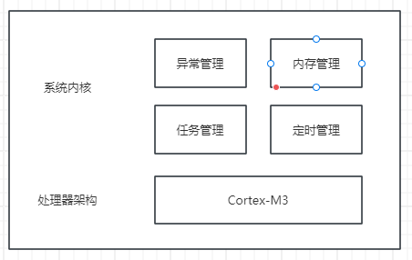
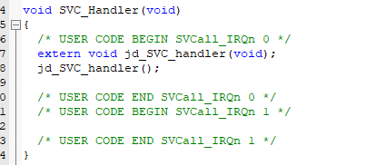

#### 介绍
jdos-简单OS！

jdos是一个简单的操作系统，实现了内存管理、任务管理、定时管理和异常管理。

jdos通过简单的设计，为嵌入式系统提供了一个轻量级的实时操作系统解决方案。

#### 软件架构

#### 使用说明
目前只有KEIL下的工程，KEIL工程通过Stm32CubeMX生成的最小工程，没用添加其他功能，使用的单片机为stm32f103rct6，移植仅仅只需要修改几行代码，说明如下：

1.jdos文件
jdos非常简单，只有7个文件，将这7个文件加入到自己的工程当中。

2.修改启动文件，修改堆大小，按需修改。

关闭中断，防止系统未初始化导致异常。

3.修改main文件，加入系统初始化函数。

4.修改异常处理函数，在stm32f1xx_it.c中修改PendSV和SVC异常处理函数。

编译试试吧！

注意：此仓库仅以stm32f103rct6测试通过，工程是以Stm32CubeMX生成的，库为hal库，若要移植到标准库，则需要适当修改，若不是Cortex-M3内核，则不适用需要大量修改。

